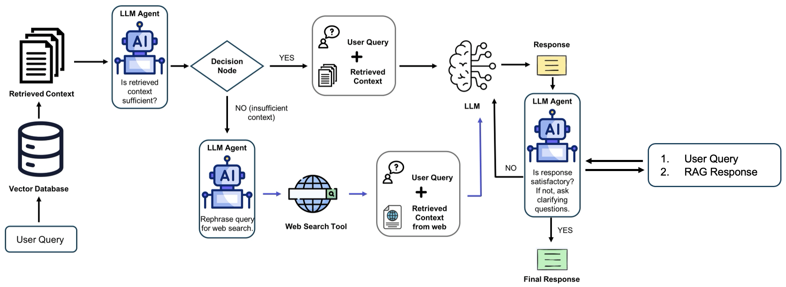

[](https://pyscaffold.org/)

# SFSA Agentic RAG Assistant



*Figure: Schematic of the SFSA Agentic RAG Assistant system architecture.*

**SFSA Agentic RAG Assistant** is an advanced question-answering system that combines local knowledge base retrieval with intelligent web search and multi-agent validation. Built on LangGraph and powered by local LLMs via Ollama, this system provides accurate, context-aware answers about steel casting, manufacturing processes, and related technical domains from SFSA documentation.

## What Makes This System Unique

Unlike traditional RAG systems, this is an **agentic architecture** with three intelligent agents working together:

- **Agent 1 (Context Checker)**: Evaluates if retrieved internal documentation is sufficient to answer the query
- **Agent 2 (Web Augmenter)**: Fetches additional information from the internet when internal docs fall short
- **Agent 3 (Validator)**: Validates response quality and triggers refinement loops for improved answers

### Key Features

- **Query Contextualization**: Automatically resolves pronouns and implicit references in follow-up questions using conversation history
- **Hybrid Retrieval**: Combines FAISS vector search (SFSA Wiki) with Tavily web search for comprehensive coverage
- **3-Agent Architecture**: Context checking, web augmentation, and iterative response validation
- **Interactive Chat Mode**: Maintains conversation memory for natural follow-up questions
- **Browser GUI**: Password-protected web interface for running batch CSV jobs, with per-member usage auditing
- **Batch Processing**: Process hundreds of questions from CSV with detailed agent decision tracking
- **Fully Configurable**: All models, thresholds, and behaviors configurable via environment variables
- **Privacy-First**: Runs entirely locally using Ollama (no data sent to external LLM APIs)

## Architecture Overview

The system implements a sophisticated multi-agent workflow orchestrated with LangGraph. Each query flows through multiple intelligent decision points:

```
┌─────────────────────────────────────────────────────────────────────────────┐
│                              USER QUERY INPUT                                │
└─────────────────────────────────────────────────────────────────────────────┘
                                      │
                                      ▼
                    ┌──────────────────────────────────┐
                    │  QUERY CONTEXTUALIZATION NODE    │
                    │  (Resolve pronouns & context)    │
                    │                                  │
                    │  • Rewrites query with history   │
                    │  • Resolves pronouns/references  │
                    │  • Makes query self-contained    │
                    └──────────────────────────────────┘
                                      │
                                      ▼
                         ┌─────────────────────────┐
                         │  RETRIEVE FROM VECTORDB  │
                         │  (FAISS + Embeddings)    │
                         │                          │
                         │  • Top-K documents       │
                         │  • SFSA Wiki content     │
                         └─────────────────────────┘
                                      │
                                      ▼
              ╔═══════════════════════════════════════════════╗
              ║            AGENT 1: CONTEXT CHECKER           ║
              ║   Evaluate if retrieved context sufficient    ║
              ║                                               ║
              ║   • Analyzes contextualized query             ║
              ║   • Checks context coverage                   ║
              ║   • Decides: sufficient or needs web search   ║
              ╚═══════════════════════════════════════════════╝
                                      │
                         ┌────────────┴────────────┐
                         │                         │
                    SUFFICIENT              INSUFFICIENT
                         │                         │
                         │                         ▼
                         │            ╔═══════════════════════════╗
                         │            ║  AGENT 2: WEB SEARCHER    ║
                         │            ║  Augment with web search  ║
                         │            ║                           ║
                         │            ║  • Reformulates query     ║
                         │            ║  • Tavily web search      ║
                         │            ║  • Retrieves web results  ║
                         │            ╚═══════════════════════════╝
                         │                         │
                         │                         ▼
                         │            ┌─────────────────────────┐
                         │            │  COMBINE WEB + VECTORDB  │
                         │            │  Context Merging         │
                         │            └─────────────────────────┘
                         │                         │
                         └─────────────┬───────────┘
                                       │
                                       ▼
                         ┌──────────────────────────┐
                         │  GENERATE RESPONSE       │
                         │  (LLM with context)      │
                         │                          │
                         │  • Uses all context      │
                         │  • Generates answer      │
                         └──────────────────────────┘
                                       │
                                       ▼
              ╔═══════════════════════════════════════════════╗
              ║          AGENT 3: RESPONSE VALIDATOR          ║
              ║   Validate quality & decide refinement        ║
              ║                                               ║
              ║   • Checks completeness                       ║
              ║   • Verifies accuracy                         ║
              ║   • Suggests refinements                      ║
              ╚═══════════════════════════════════════════════╝
                                       │
                         ┌─────────────┴─────────────┐
                         │                           │
                   SATISFACTORY              NOT SATISFACTORY
                         │                  (< max attempts)
                         │                           │
                         │                           ▼
                         │                  ┌────────────────┐
                         │                  │ Refine Query   │
                         │                  └────────────────┘
                         │                           │
                         │               ┌───────────┘
                         │               │ (Loop back to generate)
                         │               │
                         ▼               ▼
              ╔═══════════════════════════════════════╗
              ║      FORMAT FINAL OUTPUT              ║
              ║                                       ║
              ║  • Response                           ║
              ║  • Sources (Wiki + Web)               ║
              ║  • Metadata (agents, attempts)        ║
              ║  • Validation history                 ║
              ╚═══════════════════════════════════════╝
                         │
                         ▼
              ┌──────────────────────┐
              │   FINAL OUTPUT       │
              └──────────────────────┘
```

### Query Contextualization

Before retrieval, the system uses an LLM to rewrite queries based on conversation history, resolving implicit references:

- **Input**: "What are its main applications?" (after discussing steel casting)
- **Contextualized**: "What are the main applications of steel casting?"
- **Benefit**: Ensures retrieval and agents understand the full context, even in follow-up questions

### Agent Workflow

1. **Agent 1: Context Sufficiency Checker**
   - Analyzes if retrieved SFSA documents sufficiently cover the query
   - Routes to direct generation (fast path) or web search (augmentation path)
   - Outputs: Decision + reasoning

2. **Agent 2: Web Search Augmenter** (triggered only when needed)
   - Reformulates the query for effective web search
   - Uses Tavily API to fetch relevant internet sources
   - Combines web results with internal documentation

3. **Agent 3: Response Validator**
   - Validates completeness, accuracy, and relevance of generated responses
   - Suggests refined queries for regeneration if quality is insufficient
   - Loops back for up to `max_validation_attempts` (default: 2)
   - Tracks all validation attempts in metadata for batch analysis

### Data Sources

- **Primary**: SFSA Wiki documentation (vector database with FAISS + HuggingFace embeddings)
- **Secondary**: Internet sources via Tavily web search (when primary insufficient)
- **Embedding Model**: `Alibaba-NLP/gte-large-en-v1.5` (768-dim dense vectors)

## Deploying on a server

To stand this up on AWS EC2 for SFSA members — instance sizing, Ollama setup, member
accounts, systemd, and HTTPS — see **[docs/DEPLOYMENT_EC2.md](docs/DEPLOYMENT_EC2.md)**.

## Quick Start

### Prerequisites

1. **Python 3.11+** with conda/pip

2. **Ollama** - Local LLM inference engine
   - Download and install Ollama for your operating system:
     - **macOS**: Download from [https://ollama.com/download/mac](https://ollama.com/download/mac)
     - **Windows**: Download from [https://ollama.com/download/windows](https://ollama.com/download/windows)
     - **Linux**: Run `curl -fsSL https://ollama.com/install.sh | sh`
   - After installation, open a **terminal** (macOS/Linux) or **command prompt** (Windows) and pull the model:
     ```bash
     ollama pull llama3.1:8b
     ```
   - Verify Ollama is running: `ollama list`

3. **Tavily API Key** - For web search functionality (optional but recommended)
   - Visit [https://tavily.com](https://tavily.com)
   - Click "Get API Key" or "Sign Up"
   - Create a free account
   - Copy your API key from the dashboard
   - Set the environment variable:
     ```bash
     export TAVILY_API_KEY="tvly-your-api-key-here"
     ```

4. **LangChain API Key** - For LangSmith tracing (optional)
   - Visit [https://smith.langchain.com](https://smith.langchain.com)
   - Sign in or create an account
   - Go to Settings → API Keys
   - Create a new API key
   - Set the environment variables:
     ```bash
     export LANGCHAIN_API_KEY="ls__your-api-key-here"
     export LANGCHAIN_TRACING_V2="true"
     export LANGCHAIN_PROJECT="sfsa-rag-assistant"
     ```

### Installation

1. **Clone the repository**
   ```bash
   git clone git@github.com:<your-username>/sfsa-rag-assistant.git
   cd sfsa-rag-assistant
   ```

2. **Create and activate conda environment**
   ```bash
   conda env create -f environment.yml
   conda activate sfsa_rag_assistant
   ```
   
   > The environment includes the package installed in editable mode. Changes to code are immediately reflected.

3. **Configure API Keys**
   
   Copy the example environment file and edit it with your API keys:
   
   ```bash
   cp .env.example .env
   ```
   
   Open `.env` in your text editor and add your API keys:
   - `TAVILY_API_KEY` - Your Tavily API key (from step 3 in Prerequisites)
   - `LANGCHAIN_API_KEY` - Your LangChain API key (from step 4 in Prerequisites, optional)
   - Other settings can be left as defaults or customized as needed
   
   **Note**: The `.env` file is already in `.gitignore` to keep your secrets safe.

4. **Obtain or build the Vector Database**

   > **The FAISS index is not stored in this repository.** At roughly 660 MB it exceeds
   > GitHub's 100 MB per-file limit, so `src/sfsa_rag_assistant/data/` is gitignored. Copy
   > an existing `vectordb/` directory into `src/sfsa_rag_assistant/data/` (see
   > [docs/DEPLOYMENT_EC2.md](docs/DEPLOYMENT_EC2.md#6-getting-the-vector-database-onto-the-instance)),
   > or rebuild it from the source PDFs as described below.

   **Option A: Using default paths**
   
   Place your PDF files in `data/raw/` and run:
   
   ```bash
   python -c "from sfsa_rag_assistant.data_processing import DataProcessor; dp = DataProcessor(); dp.process_and_create_db()"
   ```
   
   **Option B: Using custom paths**
   
   If you want to specify custom input/output directories:
   
   ```python
   # Create a script (e.g., build_vectordb.py)
   from sfsa_rag_assistant.data_processing import DataProcessor
   
   # Specify your custom paths
   processor = DataProcessor(
       data_path="path/to/your/pdfs",      # Where your PDF files are
       vectordb_path="path/to/output/vectordb",  # Where to save the vector database
       embedding_model="Alibaba-NLP/gte-large-en-v1.5"  # Optional: change embedding model
   )
   
   processor.process_and_create_db()
   ```
   
   Then run: `python build_vectordb.py`
   
   This will:
   - Parse all PDF files recursively from your specified directory
   - Generate embeddings using HuggingFace model (`Alibaba-NLP/gte-large-en-v1.5`)
   - Build the FAISS vector index at your specified output path
   - Create metadata files for document tracking
   
   **Note**: This step only needs to be done once, or when you update your documentation. Make sure to update `VECTORDB_PATH` in your `.env` file if using a custom path.

5. **Verify Installation**
   ```bash
   python -m sfsa_rag_assistant "What is steel casting?"
   ```

### Basic Usage

#### Single Question (CLI)

```bash
# Simple query
python -m sfsa_rag_assistant "What is steel casting?"

# With detailed metadata
python -m sfsa_rag_assistant "What are the advantages of investment casting?" --show-metadata

# Hide sources
python -m sfsa_rag_assistant "Explain heat treatment." --no-sources
```

#### Interactive Chat Mode

```bash
# Start chat with conversation memory
python -m sfsa_rag_assistant --chat

# Chat with debug logging (see agent decisions)
python -m sfsa_rag_assistant --chat --debug

# Customize conversation history length
python -m sfsa_rag_assistant --chat --history 10
```

**Example chat session:**
```
You: What is steel casting?
Assistant: [Provides detailed answer with sources]

You: What are its main applications?
Assistant: [Understands "its" refers to steel casting, provides applications]

You: Compare it with forging
Assistant: [Understands "it" = steel casting, provides comparison]
```

#### Batch Processing from CSV

```bash
# Basic batch processing
python -m sfsa_rag_assistant --batch input.csv --output results.csv

# Custom question column name
python -m sfsa_rag_assistant --batch data.csv --output answers.csv --question-column "user_question"

# With validation loop control
python -m sfsa_rag_assistant --batch questions.csv --output answers.csv --max-validation-attempts 3
```

**Input CSV format:**
```csv
question
What is steel casting?
Explain the advantages of investment casting
What are common defects in casting?
```

**Output CSV includes:**
- Original question
- Agent 1 decision (sufficient/insufficient) + reasoning
- Agent 2 search query (if web search was triggered)
- Intermediate response before Agent 3
- Agent 3 validation attempts (satisfactory/question for each attempt)
- Intermediate responses after each validation loop
- Final answer
- All sources (SFSA Wiki + web)

This detailed tracking enables comprehensive evaluation of agent behavior and response quality.

#### Workflow Visualization

```bash
# Display the LangGraph workflow
python -m sfsa_rag_assistant --show-graph
```

## Configuration

All settings can be overridden via environment variables with `SFSA_` prefix.

### Key Settings

| Environment Variable | Default | Description |
|----------------------|---------|-------------|
| `SFSA_OLLAMA_MODEL` | `llama3.1:8b` | Ollama model for LLM generation |
| `SFSA_OLLAMA_BASE_URL` | `http://localhost:11434` | Ollama server URL |
| `SFSA_OLLAMA_TEMPERATURE` | `0.3` | LLM temperature (0.0 = deterministic) |
| `SFSA_OLLAMA_MAX_TOKENS` | `1000` | Max tokens per generation |
| `SFSA_VECTORDB_PATH` | `src/sfsa_rag_assistant/data/vectordb` | Path to FAISS vector database |
| `SFSA_EMBEDDING_MODEL` | `Alibaba-NLP/gte-large-en-v1.5` | HuggingFace embedding model |
| `SFSA_RETRIEVAL_K` | `5` | Top-K documents to retrieve |
| `TAVILY_API_KEY` | None | Tavily API key for web search |
| `SFSA_TAVILY_MAX_RESULTS` | `3` | Max web search results |
| `SFSA_MAX_VALIDATION_ATTEMPTS` | `2` | Max Agent 3 refinement loops |

### Example Configuration

```bash
# Use a more powerful model
export SFSA_OLLAMA_MODEL="llama3.1:70b"

# Retrieve more documents
export SFSA_RETRIEVAL_K=10

# More aggressive validation
export SFSA_MAX_VALIDATION_ATTEMPTS=3

# Enable web search
export TAVILY_API_KEY="tvly-xxxxxxxxxxxxx"

python -m sfsa_rag_assistant --chat
```

## Output Formats

### Standard Output

```
================================================================================
QUERY
================================================================================
What is steel casting?

================================================================================
RESPONSE
================================================================================
Steel casting is a manufacturing process where molten steel is poured into...

================================================================================
SOURCES
================================================================================

[1] SFSA Wiki
    Document: Introduction to Steel Casting
    Page: 3

[2] Internet
    Title: Steel Casting Process Overview
    URL: https://example.com/steel-casting
```

### Code Structure

```
src/sfsa_rag_assistant/
├── __init__.py
├── __main__.py              # Entry point
├── cli.py                   # Command-line interface
├── graph.py                 # LangGraph workflow orchestration
├── states.py                # State definitions (TypedDict)
├── app_config.py            # Pydantic settings
├── config.py                # Legacy config utilities
├── chat.py                  # Interactive chat mode
├── batch_processor.py       # CSV batch processing
├── data_processing.py       # Vector DB builder
├── wiki_utils.py            # SFSA Wiki helpers
├── generation.py            # LLM generation utilities
├── retrieval.py             # Vector store retrieval
├── nodes/                   # LangGraph nodes
│   ├── __init__.py
│   ├── contextualize_query.py      # Query rewriting
│   ├── retrieve_context.py         # Vector retrieval
│   ├── check_context_sufficiency.py # Agent 1
│   ├── web_search.py               # Agent 2
│   ├── combine_context.py          # Context merging
│   ├── generate_response.py        # LLM generation
│   ├── validate_response.py        # Agent 3
│   └── format_final_output.py      # Output formatting
└── data/
    └── vectordb/           # FAISS index + metadata
```

## Project Organization

```
├── .env.example           <- Environment variable template
├── Dockerfile             <- Optional container build
├── LICENSE.txt             <- License
├── README.md               <- The top-level README (this file)
├── environment.yml         <- Conda environment specification
├── pyproject.toml          <- Build configuration
├── setup.cfg               <- Declarative configuration
├── setup.py                <- Setuptools entry point
├── docs/_static/logo.png   <- README image
└── src/sfsa_rag_assistant/ <- Main Python package and FAISS data
```

## How It Works

### 1. Query Contextualization
- Uses LLM to rewrite queries based on conversation history
- Resolves pronouns ("it", "its", "they") to specific entities
- Makes queries self-contained for better retrieval

### 2. Vector Retrieval
- Embeds contextualized query using HuggingFace model
- Searches FAISS index for top-K similar documents
- Returns SFSA Wiki content with metadata (page, section, URL)

### 3. Agent 1: Context Sufficiency Check
- LLM analyzes if retrieved docs adequately cover the query
- Decision factors: completeness, specificity, relevance
- Routes to generation (sufficient) or web search (insufficient)

### 4. Agent 2: Web Search (Conditional)
- Reformulates query for web search effectiveness
- Fetches results from Tavily API
- Merges web content with internal documentation

### 5. Response Generation
- Combines all context sources
- Uses LLM to generate comprehensive answer
- Cites sources appropriately

### 6. Agent 3: Response Validation
- LLM evaluates response quality
- Checks: completeness, accuracy, relevance to contextualized query
- If unsatisfactory: suggests refined query and loops back
- Max attempts configurable (default: 2)

### 7. Output Formatting
- Structures final response
- Includes sources (SFSA Wiki + web)
- Adds metadata (workflow path, agent decisions, validation history)

## Use Cases

- **Research**: Query SFSA documentation with intelligent context awareness
- **Training**: Generate Q&A datasets for educational materials
- **Evaluation**: Batch process questions to evaluate RAG system performance
- **Customer Support**: Provide technical answers backed by authoritative sources
- **Knowledge Exploration**: Interactive chat for discovering steel casting knowledge

## License

This project is licensed under the terms specified in [LICENSE.txt](LICENSE.txt).

## Acknowledgments

- Built with [LangGraph](https://github.com/langchain-ai/langgraph) for workflow orchestration
- Powered by [Ollama](https://ollama.com) for local LLM inference
- Web search via [Tavily API](https://tavily.com)
- Embeddings from [HuggingFace](https://huggingface.co)
- Project scaffolding by [PyScaffold](https://pyscaffold.org)

---

**Note**: This system is designed for technical Q&A about steel casting and manufacturing. For best results, ensure Ollama is running with a capable model (8B parameters or larger) and that the vector database contains relevant SFSA documentation.

### Launch the Browser GUI

After the environment is installed, you can start a browser-based interface on the EC2 instance:

```bash
conda activate sfsa_rag_assistant
python -m sfsa_rag_assistant --gui --host 0.0.0.0 --port 7860
```

Or use the console script:

```bash
sfsa-rag-gui
```

Open `http://<your-ec2-public-ip>:7860` in a browser after allowing that port in the EC2 security group. For a production setup with HTTPS, see [docs/DEPLOYMENT_EC2.md](docs/DEPLOYMENT_EC2.md).

The GUI is a batch-testing interface. It supports:

- Uploading a CSV of questions
- Naming the output CSV (collisions are resolved automatically with a timestamp suffix)
- Live progress while the batch runs, plus total elapsed time
- Downloading the result CSV; a copy is also saved server-side in `SFSA_OUTPUT_DIR`

The model is fixed to the server's configured `SFSA_OLLAMA_MODEL` — it is not selectable
from the browser. Use the CLI for single queries and interactive chat.

### Member Authentication And Usage Tracking

The GUI can require member credentials and log usage per account. Authentication turns on **automatically once at least one active member account exists** in the local auth database — until then the interface is open to anyone who can reach the port, so create an account before exposing the service.

Create the first member account:

```bash
sfsa-rag-admin create-user sfsa_member --full-name "SFSA Member" --email "member@example.com"
```

List accounts:

```bash
sfsa-rag-admin list-users
```

Deactivate an account:

```bash
sfsa-rag-admin deactivate-user sfsa_member
```

Show recent usage:

```bash
sfsa-rag-admin usage --limit 50
```

The usage log records the member username, action type, timestamp, source IP, model used, output file, and run summary so you can review how each credential is being used.
